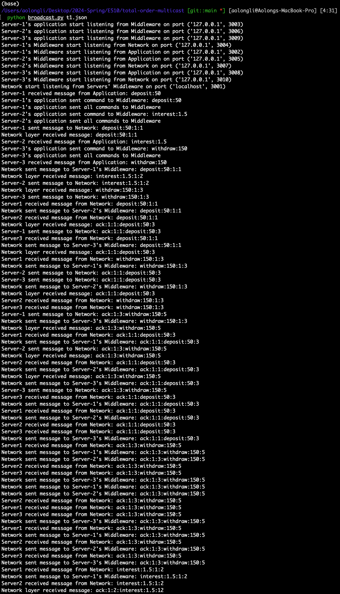

# Total Order Multicast
Lamport's algorithm implementation

## Test Instructions

Enter the following command in the terminal to run the test:

```bash
python3 lamport.py testcase
```
where `testcase` is the name of the test case file (it contains the address of all servers and network layers). 

For example, 

```bash
python3 lamport.py t1.json
```
Make sure that port 3000 - 3000 + numServers * 3 are not occupied by other processes, where numServers is the number of servers in the test case.

## Repo Structure

- `lamport.py`: the main file that runs the algorithm
- `pseudo-code.md`: the pseudo code of the algorithm and some explanation
- `proof.md`: the proof of correctness of the algorithm
- `test`: the test cases
    - `t1.json`: a test case with 3 servers with one command each
    - `t2.json`: a test case with 3 servers with multiple commands
    - `t3.json`: a test case with 7 servers with one command each and most of commands are the same (test the tie breaking part)
- `log`: the log files generated by the test cases
    - `console.txt`: the console output of the test cases
    - `Server-{ServerID}-log.txt`: contains the balance and the history of message delivered to the application layer when there is any change in the balance. Since plus, minus, and multiply not commutative in general, the final balance will heavily depend on the order of messages. Therefore, same final balance is always enough to show that the algorithm is correct. However, the history of message delivered to the application layer is also printed to show that the algorithm is correctly implemented.

## Overview

Algorithm for totally ordered multicast:
1. all messages timestamped with sender's logical time
2. all messages are sent to all processes, including the sender
3. when a message is received:
    - it is added to the local queue
    - the queue is sorted by timestamp, serverID (this is to break the tie)
    - the ack is multicast to all processes with the receiver's logical time
4. message is delivered to application ONLY when 
    - it is at the head of the queue
    - all acks for that message have been received
5. timestamp is updated when a message is sent or received (max(localTime, messageTime) + 1)
6. increment local time when there is any event (send, receive) occurs

Here we use the bank model mentioned in the slide and the textbook: there are muliple servers in different places, say San Fransico, New York, etc. Each server has an application layer which send command like (deposit, 10), (interest, 1.2) to the middleware layer. Each middleware layer will send/receive message and acknowledgement to all other servers' middleware through the network layer (there is only one network layer in total).

The application layer is the top layer of the system. It is responsible for sending command to the middleware layer. The command is in the form of `(command, value)`. The command can be `deposit`, `withdraw`, `interest`, etc. The value is the amount of money or the interest rate. The application layer will send the command to the middleware layer and wait middleware layer to reorder the messages from other servers. Once the middleware find what it think is the message deliverable, it will send the message to the application layer. The application layer will then update the balance according to the message.

We can track the history of message delivered to the application layer to see if the algorithm is correctly implemented.

More details can be found in the pseudo-code.md and comments in the code.

## Test Results
All test cases passed (many times): this can be verified by checking the final balance and the history of message delivered to the application layer for each server in the log files. 

The first case is a simple case with 3 servers with one command each. The second case is a case with 3 servers with multiple commands. The third case is a case with 7 servers with one command each and most of commands are the same (test the tie breaking part).

We also tested the implementation with 100 servers. However, we met with the OS too many open files error. So we did not include the test case in the repo because the error is related to the saving of the log files and not the correctness of the algorithm.

The log files are in the `log` folder. The console output of the test cases are also in the `log` folder. Here we attached one screenshot of the console output of `t1.json`:



## Conclusion and Future Work
The algorithm is correct and the implementation is also correct. We have tested the implementation with multiple test cases and all passed.

I chose to use socket for communication between application layer and middleware layer, middleware layer and network layer. Since not all sockets opend to send message will be working all the time, we need to have some ghost threads (the `keepSocketAlive` function is for this initiative) to send empty packet to the other side to make sure the system don't close the idling sending socket (otherwise, the listening side will not be able to receive the message and the system will be stuck) and they are not killed by system when we need to use them to send some message again. Probably some inter-process-communication mechanism (such as pipes) can make the implementation more efficient.

Also, I tried a global `threading.Event` to signal all threads to stop and sockets to close when the main thread is killed (after all operations are completed). However, it seems that the `threading.Event` is not working as expected. In the end, I need to use `Ctrl+C` to stop the program. This is not a big issue, but it is not a good practice. I will try to find a better way to stop the program in the future.